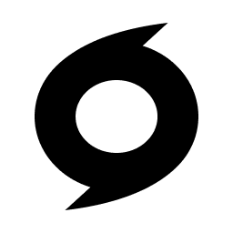

<div align="center">



# CopyDash

A Windows clipboard manager for designers and developers.

[](https://github.com/hanyiwei/copydash)
[](LICENSE)
[](https://github.com/hanyiwei/copydash/releases)

</div>

## Download

**Coming soon**

Download the latest version from [Releases](https://github.com/hanyiwei/copydash/releases):

- **`CopyDash-0.1.0-win.zip`** — unzip and run `CopyDash.exe`, no installation required.

## Features

- **Clipboard monitoring** — automatically captures text, images, files, colors, and links as you copy
- **Global shortcut** — press `Alt+Shift+V` to toggle the panel from anywhere
- **Type filters** — filter by Text, Image, Link, Color, or File
- **Full-text search** — search across all clipboard history instantly
- **Pin items** — keep frequently used clips at hand
- **Quick paste** — double-click a card to paste, or `Shift+Click` to paste as plain text
- **Right-click menu** — Copy, Paste, Paste as Plain Text, Pin/Unpin, Delete
- **Color detection** — auto-detects HEX, RGB, and HSL colors with a live preview swatch
- **Syntax highlighting** — code and markup rendered with highlight.js
- **Privacy mode** — exclude specific apps (1Password, Bitwarden, KeePass, Remote Desktop, etc.) from clipboard recording
- **Light / Dark theme** — warm beige light mode inspired by Anthropic's design, plus a dark mode
- **System tray** — runs quietly in the system tray
- **Configurable history** — set max history to 100, 200, or 300 items
- **Transparent panel** — always-on-top frameless window with smooth enter/exit animations

## Keyboard Shortcuts

| Shortcut | Action |
|----------|--------|
| `Alt+Shift+V` | Toggle CopyDash panel |
| `Double-click` | Paste selected item |
| `Shift+Click` | Paste as plain text |
| `Right-click` | Context menu |
| `Esc` | Clear all filters |
| `Mouse wheel` | Scroll cards horizontally |

## Tech Stack

| Layer | Technology |
|-------|-----------|
| Shell | Electron 30 |
| UI | React 18 + TypeScript |
| Styling | Tailwind CSS 3 |
| State | Zustand |
| Database | SQLite (sql.js) |
| Highlighting | highlight.js |
| Image processing | Jimp |
| Icons | Lucide React |
| Build | electron-vite |

## Development

```bash
# Install dependencies
npm install

# Start dev server
npm run dev

# Build for production
npm run build

# Package for distribution
npm run dist
```

## Project Structure

```
src/
├── main/            # Electron main process
│   ├── index.ts     # Window management, IPC, tray, global shortcuts
│   ├── monitor.ts   # Clipboard polling, format detection, content hashing
│   └── db/          # SQLite database layer
├── preload/         # Context bridge (contextBridge)
└── renderer/        # React UI
    ├── App.tsx      # Root layout
    ├── components/  # ClipItem, ClipList, SearchBar, SettingsPanel
    ├── store/       # Zustand state management
    ├── utils/       # Syntax highlighting, URL detection, type matching
    └── styles/      # Tailwind + custom CSS
```

## License

MIT
